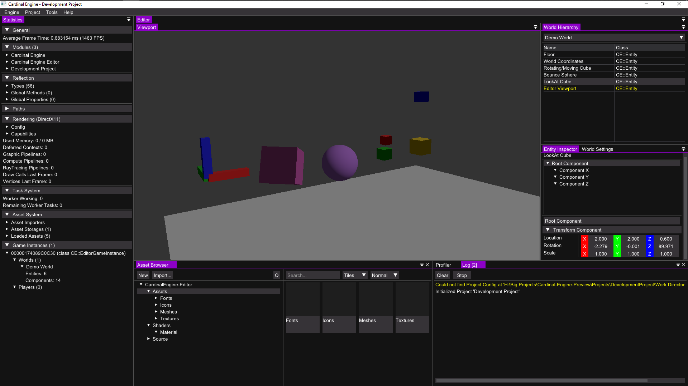

# Cardinal-Engine

#### Used technology

* [C++](https://isocpp.org/)
* [Vulkan](https://vulkan.lunarg.com/)
* DirectX11
* [stb_image](https://github.com/nothings/stb/blob/master/stb_image.h)
* [stb_truetype](https://github.com/nothings/stb/blob/master/stb_truetype.h)
* [Dear ImGui](https://github.com/ocornut/imgui)

### Features
* Windows
* ~~Linux~~ (**Not Implemented yet**)
* ~~MacOS~~ (**Not Implemented yet**)
* Multithreaded Rendering
* On the fly HLSL to SPIR-V compilation and reflection
* Deferred physically based rendering (PBR) (**Not fully implemented**)
* Object serialization
* Asset managment system using serialization
* Entity component system
* Model file loading (obj, ...)
* Image file loading (png, jpeg, dng, tiff, OpenEXR, bmp, dds, ppm, tga)
* Module system for dynamic module loading (Modding support)
* Reflection system
* Editor

### Requirements
* Visual Studio 2019/2022
* Python (for the Setup)
* DirectX11

### Gallery

